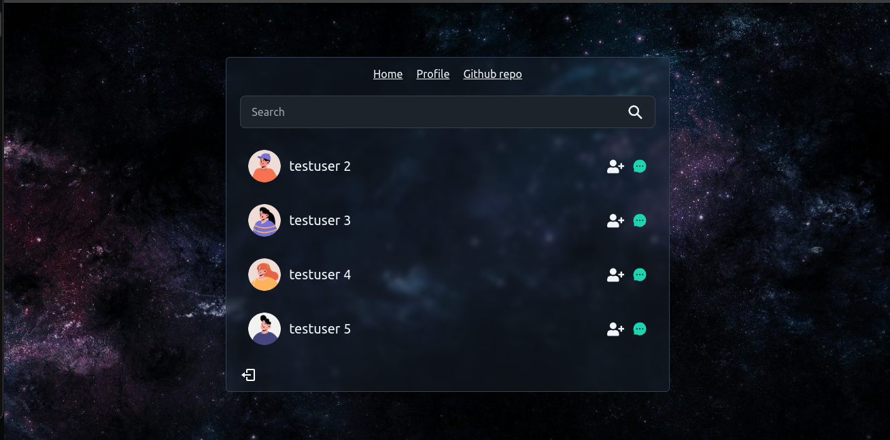

# Wia Blog
A typical messaging site with MERN and socket.io

## Features
- normal user authentication
- realtime messages

## Demo
[Messagin site demo]()

## Screenshots

## Tech Stack
- HTML
- CSS
- Tailwind css with [daisy ui](https://daisyui.com/)
- React
- basic zustand
- Expressjs
- MongoDB (Mongoose, Atlas)

## Hosting
- [Render] (https://render.com/)