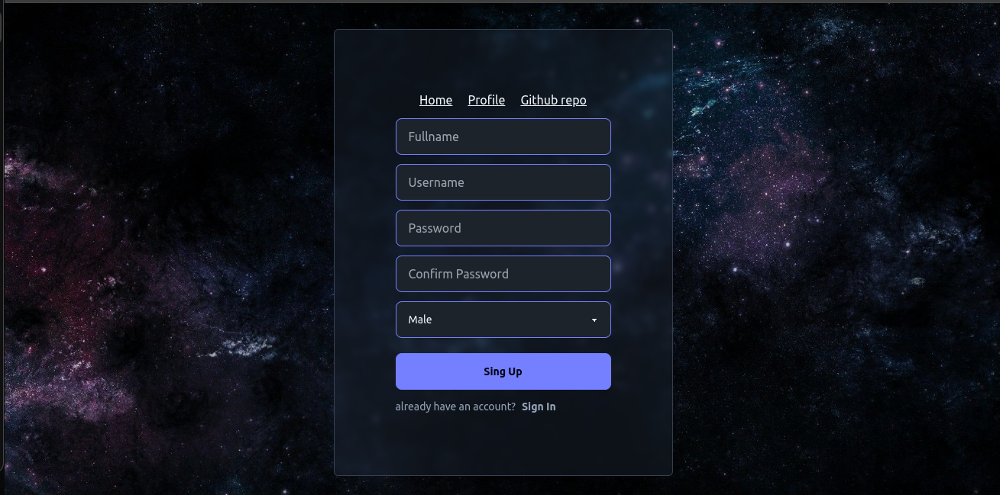

# Messaging app
A typical messaging site with MERN and socket.io

## Features
- normal user authentication
- realtime messages
- realtime add/accept friend

## Demo
[Messagin site demo](https://messaging-app-wymh.onrender.com)

## Screenshots




## Tech Stack
- HTML
- CSS
- Tailwind css with [daisy ui](https://daisyui.com/)
- React
- basic zustand
- Expressjs
- MongoDB (Mongoose, Atlas)

### .env
in backend (root folder)

```
PORT
MONGODB_URI
JWT_SECRET_KEY
```

## Hosting
- [Render] (https://render.com/)
